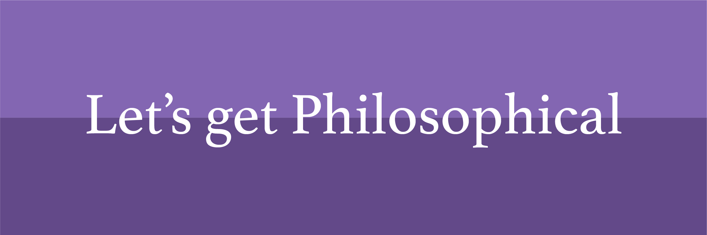

### Hi there, welcome to my Github Profile!

<!--
**ShenZhouHong/ShenZhouHong** is a ✨ _special_ ✨ repository because its `README.md` (this file) appears on your GitHub profile.

Here are some ideas to get you started:

- 🔭 I’m currently working on ...
- 🌱 I’m currently learning ...
- 👯 I’m looking to collaborate on ...
- 🤔 I’m looking for help with ...
- 💬 Ask me about ...
- 📫 How to reach me: ...
- 😄 Pronouns: ...
- ⚡ Fun fact: ...
-->

My name is Shen. I'm a current Philosophy and Computer Science student. I'm a passionate, self-directed learner, who always loves reading about exciting happenings in the world of Philosophy and Science. I'm currently working on my studies in Philosophy and Computer Science- there's always so much to learn! In the future, I plan to get into grad school in Computer Science.

I'm always looking for chats, conversation, and mentorship. Feel free to reach out to me if you want to talk!
